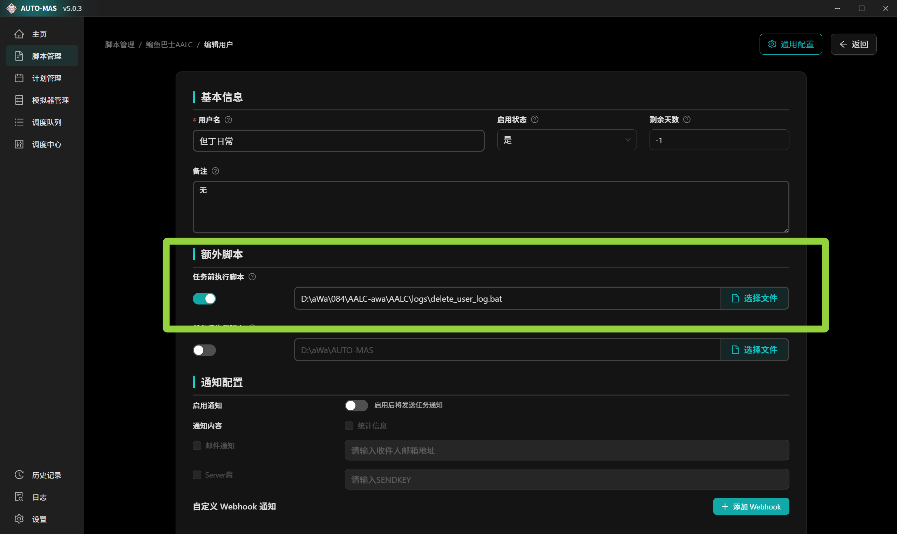

# MAS 运行AALC时候所需要添加的bat文件

## 若你是搜索AALC或者MAS——atuo的话，你找错地方了，对此我感到抱歉,以下为AALC和MAS——atuo的Github仓库

[AALC](<https://github.com/KIYI671/AhabAssistantLimbusCompany>)

[MAS_—atuo](<https://github.com/AUTO-MAS-Project/AUTO-MAS>)

## 用MAS运行AALC时需要添加的bat文件，具体操作看如下文档

    首先确保你已经知道如何使用通用模版进行配置 
        不会的话请 
[阅读MAS官方文档](<https://doc.auto-mas.top/docs/script-guide/general.html>)

不配置bat的话你将会直接运行直接结束，因为检查到了昨天的日志

